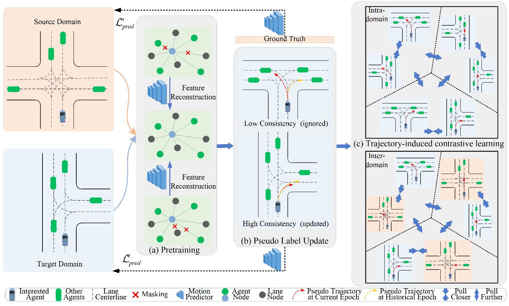

# PseuMo: Pseudo-label Guided Unsupervised Domain Adaptation on Motion Forecasting





Table of Contents
=================
  * [Install Dependancy](#install-dependancy)
  * [Prepare Data](#prepare-data-argoverse-motion-forecasting)
  * [Training](#training)
  * [Testing](#testing)
  * [Licence](#licence)
  * [Acknowledgement](#Acknowledgement)


## Install Dependancy
You need to install following packages in order to run the code:
- [PyTorch>=1.3.1](https://pytorch.org/)
- [Argoverse API](https://github.com/argoai/argoverse-api#installation)

1. Clone this repository:
```
git clone https://github.com/neurips23-PseuMo/code.git
cd code
```

2. Following is an example of create environment **from scratch** with anaconda, you can use pip as well:
```sh
conda create --name lanegcn python=3.7
conda activate lanegcn
conda install pytorch==1.5.1 torchvision cudatoolkit=10.2 -c pytorch # pytorch=1.5.1 when the code is release

# install argoverse api
pip install  git+https://github.com/argoai/argoverse-api.git

# install others dependancy
pip install scikit-image IPython tqdm ipdb
```

3. \[Optional but Recommended\] Install [Horovod](https://github.com/horovod/horovod#install) and `mpi4py` for distributed training. Horovod is more efficient than `nn.DataParallel` for mulit-gpu training and easier to use than `nn.DistributedDataParallel`. Before install horovod, make sure you have openmpi installed (`sudo apt-get install -y openmpi-bin`).
```sh
pip install mpi4py

# install horovod with GPU support, this may take a while
HOROVOD_GPU_OPERATIONS=NCCL pip install horovod==0.19.4

# if you have only SINGLE GPU, install for code-compatibility
pip install horovod
```
if you have any issues regarding horovod, please refer to [horovod github](https://github.com/horovod/horovod)

## Prepare Data: Argoverse Motion Forecasting
You could check the scripts for Argoverse Motion Data v1.1, and download the processed data instead of running it for hours.
```sh
bash get_data.sh
```
After downloading and extracting the tar.gz files, the dataset directory should be organized as follows:
```
/path/to/dataset_root/
├── train/
|   └── data/
|       ├── 1.csv
|       ├── 2.csv
|       ├── ...
└── val/
    └── data/
        ├── 1.csv
        ├── 2.csv
        ├── ...
```
The processed dataset directory should be organized as follows:
```
/path/to/dataset_root/
├── preprocess/
    ├── train_crs_dist6_angle90.p
    ├── mia_train_crs_dist6_angle90.p
    ├── pit_train_crs_dist6_angle90.p
    ├── val_crs_dist6_angle90.p
    ├── mia_val_crs_dist6_angle90.p
    ├── pit_val_crs_dist6_angle90.p
    ├── test_test.p
    ├── mia_test_test.p
    └── pit_test_test.p
```

## Training


### [Recommended] Pre-training and training with Horovod-multigpus

1. Pre-training
```sh
# single node with 4 gpus
# for the m2p task
horovodrun -np 4 -H localhost:4 python /path/to/pretrain.py -m lanegcn_m2p_pre
# for the p2m task
horovodrun -np 4 -H localhost:4 python /path/to/pretrain.py -m lanegcn_p2m_pre
``` 
```sh
# [Optional] 2 nodes, each with 4 gpus
# for the m2p task
horovodrun -np 8 -H serverA:4,serverB:4 python /path/to/pretrain.py -m lanegcn_m2p_pre
# for the p2m task
horovodrun -np 8 -H serverA:4,serverB:4 python /path/to/pretrain.py -m lanegcn_p2m_pre
``` 
Notice that you need to select the best model as your pre-trained model.


2. Training
```sh
# single node with 4 gpus
# for the m2p task
horovodrun -np 4 -H localhost:4 python /path/to/train.py -m lanegcn_m2p --weight ${CKPT_FILE}
# for the p2m task
horovodrun -np 4 -H localhost:4 python /path/to/train.py -m lanegcn_p2m --weight ${CKPT_FILE}
``` 
```sh
# [Optional] 2 nodes, each with 4 gpus
# for the m2p task
horovodrun -np 8 -H serverA:4,serverB:4 python /path/to/train.py -m lanegcn_m2p --weight ${CKPT_FILE}
# for the p2m task
horovodrun -np 8 -H serverA:4,serverB:4 python /path/to/train.py -m lanegcn_p2m --weight ${CKPT_FILE}
``` 

### Training/Debug with Horovod in single gpu 
```sh
python train.py -m lanegcn_m2p --weight ${CKPT_FILE}
```
```sh
python train.py -m lanegcn_p2m --weight ${CKPT_FILE}
```


## Testing
### Inference test set for submission
```
python test.py -m lanegcn --weight=/absolute/path/to/${CKPT_FILE} --split=test
```
### Inference validation set for metrics
```
python test.py -m lanegcn --weight=${CKPT_FILE} --split=val
```


## Licence
check [LICENSE](LICENSE)

## Acknowledgement

Our code builds upon [LaneGCN](https://github.com/uber-research/LaneGCN). 
We appreciate all the contributors for their awesome work.